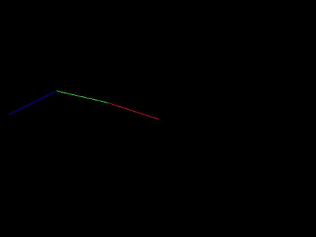

# 2D Inverse kinematics solver for a 2D redundant robotic arm
Three diferent methods are used to solve the inverse kinematics:
- Jacobian pseudo transpose
- Jacobian transpose
- Jacobian pseudo transpose + null-space<br/>
## Example of the visualisation:<br/>

## Usage:
1. Download the repository
2. Install the required libraries defined in requeriments.txt
3. Run the main file providing the solving method (```-m, --method```):
  - p -> Pseudo transpose
  - t -> Transpose
  - n -> Null space (Default)<br/>

<br/>E.g.
```
python3 main.p -m p
```
